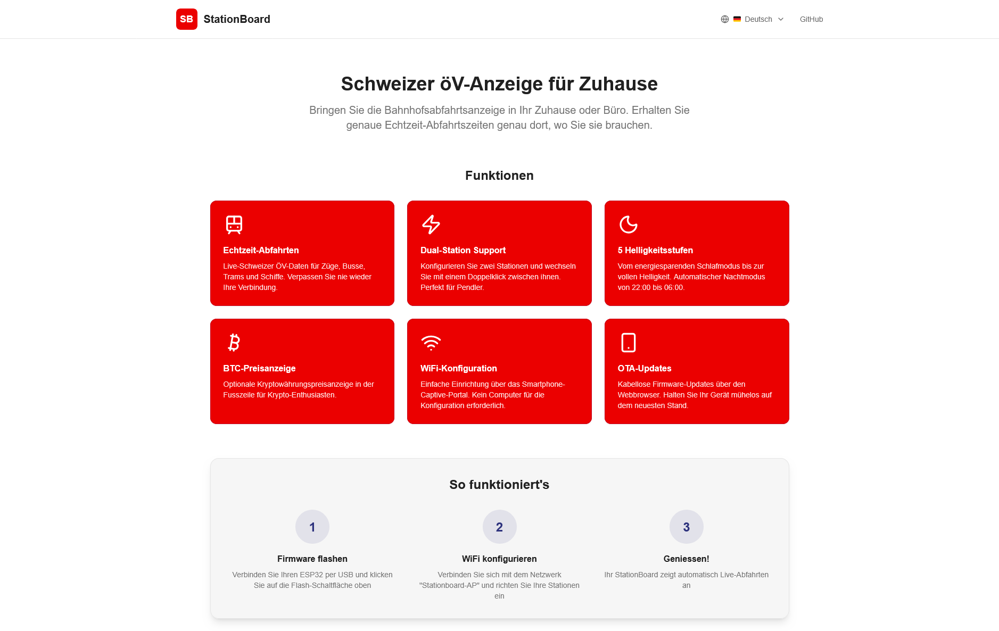

# StationBoard Uploader

[](https://nextjs.org/)
[](https://www.typescriptlang.org/)
[](https://tailwindcss.com/)

Web-based firmware uploader for [StationBoard](https://github.com/pashol/Stationboard) - a Swiss public transport display for your home or office. Flash your ESP32-2432S028R directly from the browser without installing any software.



## Features

- **Browser-based flashing** - No software installation required
- **Multi-language support** - English, German, French, Italian (German default)
- **Mobile-friendly** - Works on smartphones and tablets
- **Fast flashing** - Optimized for ESP32 devices at 921600 baud
- **Version selection** - Choose from available firmware versions
- **Progress tracking** - Real-time flash progress with visual feedback
- **Auto device detection** - Supports CP210x, CH340, FTDI and Espressif USB chips

## Supported Hardware

- **ESP32-2432S028R** (CYD - "Cheap Yellow Display")
- ESP32 with integrated 2.8" ILI9341 TFT display (320x240)
- USB connection (Chrome, Edge, or Opera browser required)

## Browser Requirements

The Web Serial API is required for flashing firmware. Supported browsers:

- Google Chrome (recommended)
- Microsoft Edge
- Opera
- Safari (not supported)
- Firefox (not supported)

## Getting Started

### Prerequisites

- Node.js 18+
- npm or yarn

### Development

```bash
# Clone the repository
git clone https://github.com/pashol/StationboardUploader.git
cd StationboardUploader

# Install dependencies
npm install

# Start development server
npm run dev

# Open http://localhost:3000
```

### Build for Production

```bash
# Create static export
npm run build

# Output will be in dist/ directory
```

### Linting

```bash
npm run lint
```

## Project Structure

```
src/
├── app/                    # Next.js App Router
│   ├── layout.tsx         # Root layout with Geist fonts
│   ├── page.tsx           # Home page
│   ├── globals.css        # Global styles and SBB color palette
│   └── fonts/             # Local font files (GeistVF, GeistMonoVF)
├── components/            # React components
│   ├── FirmwareUploader.tsx   # Main flashing component
│   ├── LanguageSelector.tsx   # Language switcher
│   ├── MarketingSection.tsx   # Landing page content
│   ├── VersionNotes.tsx       # Version history
│   └── Footer.tsx             # Footer component
└── lib/
    └── i18n/              # Internationalization
        ├── I18nContext.tsx
        └── translations.ts

public/
└── firmware/              # Firmware binaries organised by version
    ├── versions.json
    ├── 1.2.1/
    │   ├── bootloader.bin
    │   ├── partitions.bin
    │   └── firmware.bin
    ├── 1.2.0/
    ├── 1.1.0/
    └── 1.0.0/
```

## How It Works

1. **Connect Device** - Plug your ESP32-2432S028R via USB
2. **Select Version** - Choose firmware version from dropdown (latest pre-selected)
3. **Click Flash** - Browser requests serial port access via Web Serial API
4. **Wait** - Firmware downloads and flashes automatically; progress shown in real time
5. **Done!** - Device resets and boots the new firmware automatically

## Firmware Format

Firmware files live under `public/firmware/<version>/`:

- `bootloader.bin` - ESP32 bootloader (address: 0x1000)
- `partitions.bin` - Partition table (address: 0x8000)
- `firmware.bin` - Main application (address: 0x10000)
- `versions.json` - Version metadata (at `public/firmware/versions.json`)

Example `versions.json`:
```json
{
  "versions": [
    {
      "version": "1.2.1",
      "date": "2026-01-29",
      "changes": [
        "Fix night mode refresh after temporary wake or exit",
        "Restore brightness behavior on wake in night mode",
        "Avoid sleeping immediately after temporary night wake"
      ],
      "files": {
        "bootloader": "stationboard-v1.2.1-bootloader.bin",
        "partitions": "stationboard-v1.2.1-partitions.bin",
        "firmware": "stationboard-v1.2.1-firmware.bin"
      }
    }
  ]
}
```

The array is ordered newest-first. The uploader automatically selects the first entry as the default version.

## Internationalization

Supported languages:
- English (en)
- German (de) — default
- French (fr)
- Italian (it)

Translations are stored in `src/lib/i18n/translations.ts`.

## Deployment

This project is configured for static export. Deploy the `dist/` folder to any static hosting service:

- **GitHub Pages** - Push to `gh-pages` branch
- **Vercel** - Connect GitHub repository
- **Netlify** - Drag and drop `dist/` folder
- **AWS S3** - Upload `dist/` contents

## Related Projects

- [StationBoard](https://github.com/pashol/Stationboard) - The ESP32 firmware that this uploader flashes

## Contributing

Contributions are welcome! Please read our [AGENTS.md](./AGENTS.md) for development guidelines.

## License

MIT License - see [LICENSE](./LICENSE) for details.

---

Made with love in Switzerland
